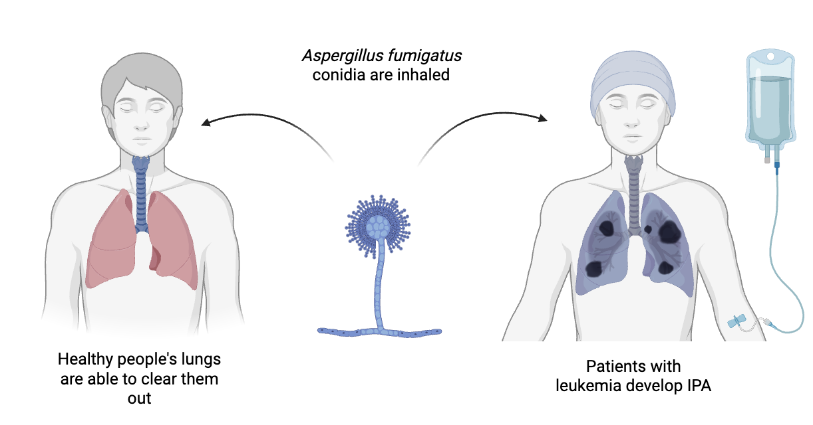
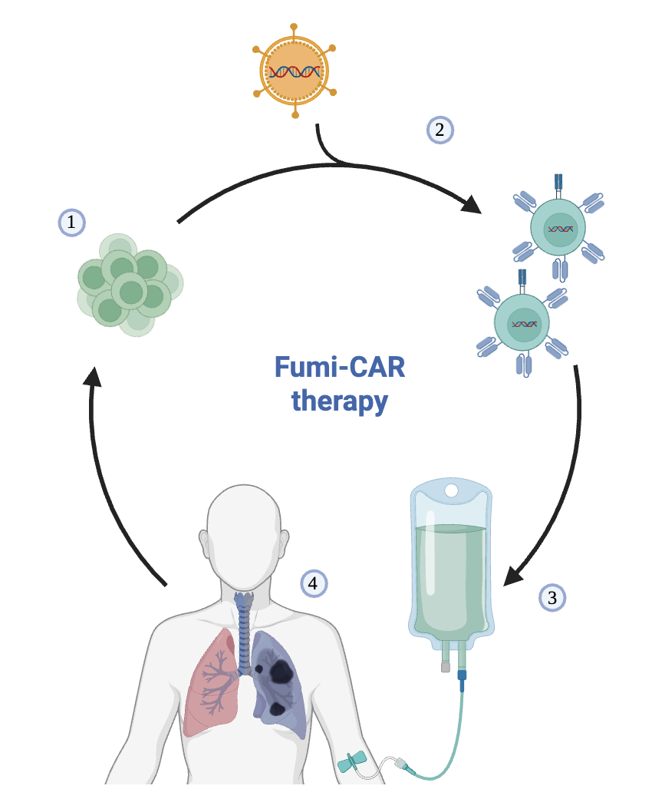

# The Problem:

Every day, we breathe in tiny particles from a common mould. Our bodies deal with 
them without us ever noticing. But for people with leukaemia, whose immune systems 
are already weakened by the disease and its treatment, these same particles can cause 
a severe lung infection that becomes life-threatening.

This infection affects more than 1 in 20 leukaemia patients. Despite treatment, almost 
half of them do not survive. The medicines available today are harsh, often clash with 
cancer drugs, and are slowly losing their power as the mould becomes resistant to them.
 Something new is needed.

# The Approach:

Fumi-CAR is an experimental therapy that uses the patient's own immune cells — 
the body's natural defenders — and teaches them in the laboratory to recognise 
and attack the mould.

- **Step 1 — Collect:** A small sample of immune cells is taken from the patient's blood.

- **Step 2 — Train:** In the lab, these cells are given a new ability — to spot the mould and know it is dangerous.

- **Step 3 — Return:** The trained cells are given back to the patient, where they seek out the infection.

- **Step 4 — Fight:** Once they find the mould, they attack it directly and call on other immune cells to help.

# Why It Matters:

- **For patients and families:** A fungal infection on top of leukaemia can feel like too much to bear. Fumi-CAR is being developed for these patients — to offer a new option when nothing else is working.

- **For medicine:** This is one of the first times this kind of therapy has been used against an infection rather than cancer. It could change how we treat dangerous infections in the future.

- **For all of us:** Fewer people lost to this infection means fewer families devastated, and less pressure on hospitals. It is a small step toward a world where our own immune system becomes our most powerful medicine.

<a href="{{ site.baseurl }}/assets/docs/TFG_FumiCAR_Serarols.pdf" class="btn btn-primary" target="_blank">Read the full project</a>
